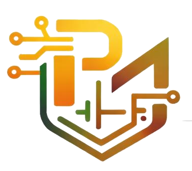

# <p align="center"><br>PrimeMOS™ • Semiconductor Console HUD</p>

<p align="center">
  
  
  
  
</p>

---

## 🔬 Overview

**PrimeMOS** is a state-of-the-art interactive Silicon Die Console & HUD dashboard representing the future of Electronics & Communication Engineering (ECE) simulation. Designed with a custom semiconductor color palette—inspired by **Silicon Wafers**, **Copper Traces**, and **Solder Pins**—this dashboard serves as the digital gateway for next-generation VLSI layouts, RTL-to-GDSII logic synthesis, and automated EDA solvers.

The suite is scheduled to launch officially on **May 30th, 2026**.

---

## ⚡ Key Architectural Features

### 1. Interactive Silicon Wafer Die Core
An interactive, vector-drawn silicon die package featuring three modular micro-sectors:
*   **CMOS / VLSI Core Block (Integrated)**: Sub-micron transistor-level layouts, high-performance analog/digital cells, and DRC/LVS validation.
*   **RTL to GDSII Flow Engine (Synthesis Ready)**: Automated floorplanning, physical placement solvers, global routing, and Clock Tree Synthesis (CTS).
*   **EDA Solvers & Methods Block (Algorithms Loaded)**: Specialized Steiner minimal tree wire routing routers, A* shortest-path engines, and delay estimations.
*   *Interaction*: Hovering over or selecting different sectors triggers high-fidelity energy bus signal routing and displays live dynamic ECE diagnostic boards below the socket.

### 2. Real-Time ECE Compiler Terminal Simulator
*   Simulated multi-threaded compiler logs that dynamically update on sector activation.
*   Real-time typing simulations detailing device size compute, placement slack timing validation (setup/hold), routing channel optimization, and physical layout checks.

### 3. Integrated Telemetry & Oscilloscope
*   **Atmospheric Telemetry**: Interactive headers tracking real-time microchip parameters (Core Temperature: `32.4°C` and Clock Frequency: `5.8 GHz`).
*   **Signal Waveform Generator**: Dual-channel CSS animated SVG oscilloscope displaying:
    *   **CH1 (Digital)**: 1.8V Clock square wave logic pulse (Green).
    *   **CH2 (Analog)**: Vout sine wave modulating signal (Gold).

### 4. PCB Breakout Shield Footer
Designed in the likeness of an ECE Printed Circuit Board development shield, routing critical contact portals through gold-plated copper traces:
*   **LinkedIn**: Functional LinkedIn networking port.
*   **WhatsApp**: High-performance community communication channel.
*   **ResearchGate**: Advanced academic research gate portal.
*   **Analog Voice Ports**: Integrated click-to-call mobile nodes.
*   **Digital Mail Packets**: Direct email communication channels.

---

## 📱 Mobile-First Ultra-Compact UI Design

The console features custom media queries designed to provide a perfect dashboard console experience down to **320px viewports**:
*   **Auto-Adapting Status Bars**: Condenses long diagnostic labels to prevent layout overflow (`CORE TEMPERATURE: 32.4°C • CLOCK: 5.8 GHz` automatically scales to `TEMP: 32.4°C • CLK: 5.8 GHz` on mobile).
*   **Micro-Scaled Elements**: Auto-adjusts card paddings, grid layouts, terminal heights, and oscilloscope dimensions.
*   **Substrate Pin Protection**: Shrunks socket pins and coordinates to stay perfectly inside the boundaries.
*   **Responsive Word Wrapping**: Implements `overflow-wrap: break-word` on long continuous contact links to guarantee 0px horizontal overflow.

---

## 🛠️ Local Installation & Development

To host and interact with the ECE HUD console locally, follow these simple steps:

### 1. Clone the Repository
```bash
git clone https://github.com/adithyayanamalamanda/welcome-page.git
cd welcome-page
```

### 2. Start a Local Dev Server
Since the terminal logs and assets require a local host environment to prevent CORS issues, launch a lightweight HTTP server:

**Using Python (Recommended):**
```bash
python -m http.server 8000
```

**Using Node.js/NPM:**
```bash
npm install -g http-server
http-server -p 8000
```

### 3. Launch Console
Open your preferred web browser and navigate to:
```
http://localhost:8000/coming_soon.html
```

---

## 🎨 Tech Stack & Styling Palette

*   **Structure**: Semantic HTML5 markup, responsive inline SVG vector components, and custom vector layouts.
*   **Interactions**: Vanilla JavaScript logic powering simulated typist logs, interactive die sector previews, and real-time countdown bezel logic.
*   **Styling (Vanilla CSS)**: High-tech semiconductor styling tokens:
    *   **Silicon Gold**: `#EBA413`
    *   **Substrate Green**: `#247F43`
    *   **Tech Orange**: `#C75124`
    *   **Dark Wafer Base**: `#050706`

---

<p align="center">
  Designed & Powered by <strong>PrimeMOS™ Research & Solutions</strong>
</p>
