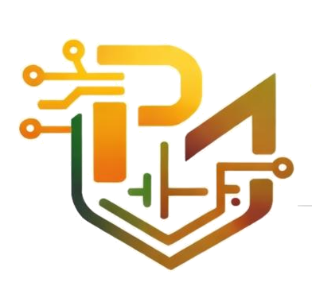
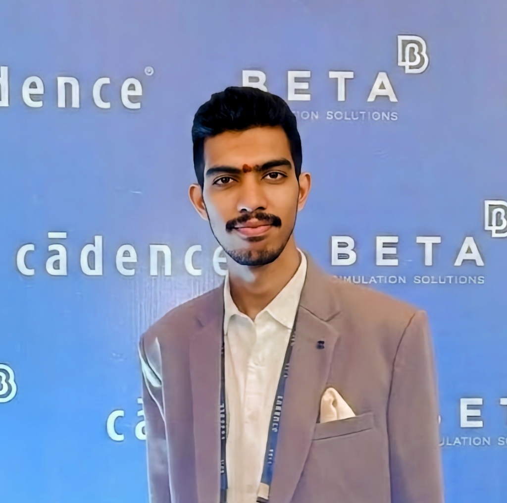

# 
 PrimeMOS Research & Solutions

  <strong>Transforming Digital Visions into Silicon Reality</strong> 
  <em>Advanced CMOS/VLSI Design, RTL-to-GDSII Physical Implementation, and Specialized ECE Engineering Mentorship</em>

  
  
  

---

## 🔬 About PrimeMOS

PrimeMOS Research & Solutions is a premier semiconductor-focused research, education, and consulting firm. Founded on the principles of engineering excellence and industrial rigor, we bridge the gap between academic theory and cutting-edge digital silicon implementation.

We specialize in high-performance, low-power **CMOS/VLSI Design**, end-to-end **RTL-to-GDSII Physical Flows**, and robust Electronic Design Automation (**EDA**) methodologies. Through our academic initiatives and consulting practices, we empower the next generation of electronics engineers and assist corporate partners in accelerating complex chip-design schedules.

---

## 🌟 Core Pillars & Offerings

### 1. Student Services
Dedicated support and mentorship engineered for undergraduate and graduate electronics students to master technical concepts and excel professionally:
* **Academic Excellence**: Complete guidance on college major/mini design projects.
* **Research Mentorship**: End-to-end assistance in drafting and submitting original VLSI/IoT research papers to top IEEE/Springer conferences.
* **VLSI & IoT Ideas**: Access to research-grade hardware-software co-design proposals.
* **Career Readiness**: One-on-one resume reviews and technical mock interview preparation.

### 2. Research & Internships
An intensive, highly competitive research internship program providing hands-on exposure to standard silicon design flows:
* **Duration**: 3 to 5 Weeks (Fully Remote intake).
* **Focus Areas**: CMOS VLSI Design, Digital IC Layouts, EDA Tool Integrations, and RTL-to-GDSII.
* **Key Gain**: Experience drafting research publications under senior guidance and state-of-the-art simulator environments.

### 3. Corporate Training
Tailored upskilling solutions designed for engineering teams to adopt the latest physical design, timing closure, and functional verification methodologies.

### 4. Consulting Solutions
Expert physical design implementation, chip verification, power optimization, and sign-off analysis to help silicon startups and design houses hit tape-out successfully.

---

## 👨‍💻 Founder Spotlight

   
  <strong>P V S D D Mallikarjuna</strong> 
  <em>Founder, PrimeMOS Research & Solutions</em>

  <strong>Associate Member of IETE | VLSI Researcher | Semiconductor Innovator</strong>

PVSDD Mallikarjuna is a highly dedicated research engineer specializing in CMOS and Digital Integrated Circuit (IC) design. Possessing extensive experience in industry-standard environments—including Cadence Virtuoso, Xilinx Vivado, OpenLane, and SkyWater PDK—he is an IEEE-published researcher and a former Defense Research and Development Laboratory (DRDL) intern, currently specializing in AI-Enabled VLSI Design. Passionate about educational democratization, he established PrimeMOS to provide real-time, industrial-grade VLSI and semiconductor research experience to aspiring students.

  
  

## 📞 Contact & Support

For collaborations, project guidance applications, or consulting inquiries, reach out through our verified contact points:

| Channel | Details |
| :--- | :--- |
| **📧 Email** | [PrimeMOS.research@gmail.com](mailto:PrimeMOS.research@gmail.com) |
| **📞 Contact 1** | [+91 8019847793](tel:8019847793) |
| **📞 Contact 2** | [+91 9849925593](tel:9849925593) |
| **📍 Office Location** | Hyderabad, Telangana, India |

---

  &copy; 2026 PrimeMOS Research & Solutions. All rights reserved.

